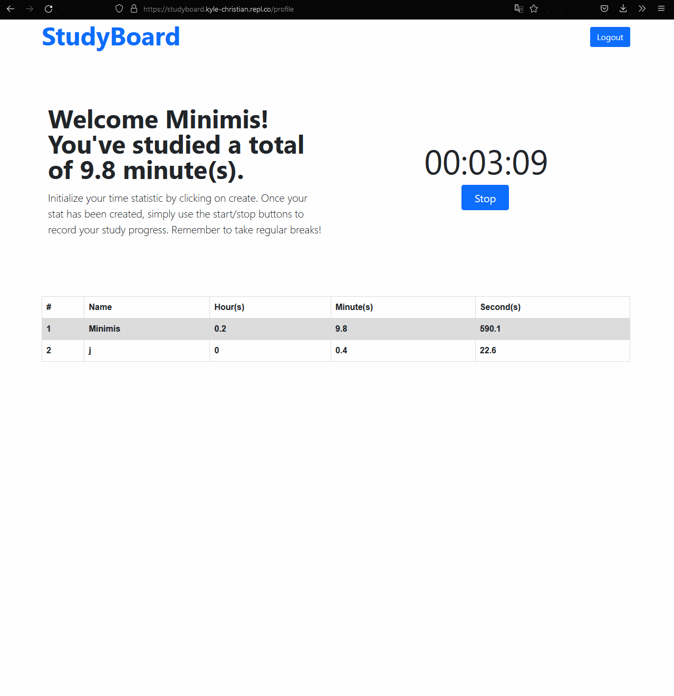

# Introduction

A Simple Accountability Leaderboard App for 100Devs Members built using the MVC Architecture, we have also implemented "authorization" so folx can sign up and track their progress compared to other users.

**Link to project:** https://studyboard.kyle-christian.repl.co/

# How It Works:

1. Signup as a user and login.
2. Report your minutes spent on classes/homework/projects daily.
3. See your stats tracked in your own personal leaderboard (great for metrics when discussing in interviews/visualizing your own personal growth in your coding journey).
4. On the main screen before login, it will show a leaderboard of all 100Devs Members.

---

# How It's Made:

**Tech used:** HTML5, CSS3, Bootstrap, JavaScript, Node.js, Express.js, Mongoose, Passport, MongoDB, EJS, bcrypt

We envisioned an "accountability" app for users to compare their study statistics with other 100Dev peers. With the help of the MVC architecture, we were able to create an easily navigable enviroment. This led to more production and less asking of where certain code was located. Passport was used for user authentication with bcrypt as a password "salter". 

When users log in and create an account, they're presented with a "create" button that sends a post request to the server, which is then routed to the DB where their "time" statistic is created. We then use these values in the leaderboard and divide the time to show hours, minutes, and seconds respectively. 

The timer itself contains two different functions. One is a constructor function that records the user's time and updates MongoDB every time it is stopped. The other function is a timer function that displays the elapsed time to the user directly.

We hope you enjoy our app!

---

## Optimizations

- Ideally we would want to expand on the stopwatch element to do pomodoro's rather than counting up. This would promote regular breaks to the user.

- Furthermore we would like to combine both of the functions stated in How It's Made to reduce bloat.

- We would also want to host this on a different platform as repl.it in its current state takes a bit too long to "wake up" which affects user retainment.

- Users should be able to visit each other's profiles rather than being limited to their own.

- The ability to upload a profile photo is in the cards as well so that user's have more personalization when it comes to their profile.

---

## Lessons Learned:

This is the first group project that many of us took part of. It was a logistical hurdle to try and plan meetings around the different time zones but we communicated clearly which led to a painless workflow. 

We learned how to assign different features/styling to different people. However, it was a bit of a struggle to agree on styling. Therefore we opted to use Bootstrap instead for painless/continuous styling.

Sticking meticulously to the MVC architecture helped us navigate the codebase easier and abstracted a lot of unnecessary code from developers working on unrelated features.

---

# Install all the dependencies or node packages used for development via Terminal

`npm install` 

---

# Things to add

- Create a `.env` file and add the following as `key: value` 
  - PORT: 2121 (can be any port example: 3000) 
  - DB_STRING: `your database URI` 

---

# Acknowledgements 
## Special Thanks to the Original Contributors (in no particular order)  
  - Kyle Christian https://github.com/kyle-christian
  - Jasmine P. Vo https://github.com/jasminepvo
  - Justin Dickson https://github.com/jay-nakagawa
  - Tim Quattrochi https://github.com/Tim-Quattrochi
  - Placeholder for Wonuola
  
 
  ## Shout Out to the Goat
  
    - Leon Noel https://github.com/leonnoel

